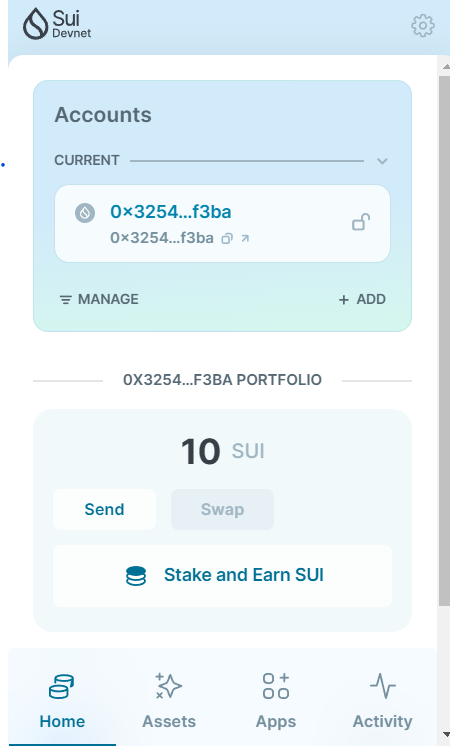
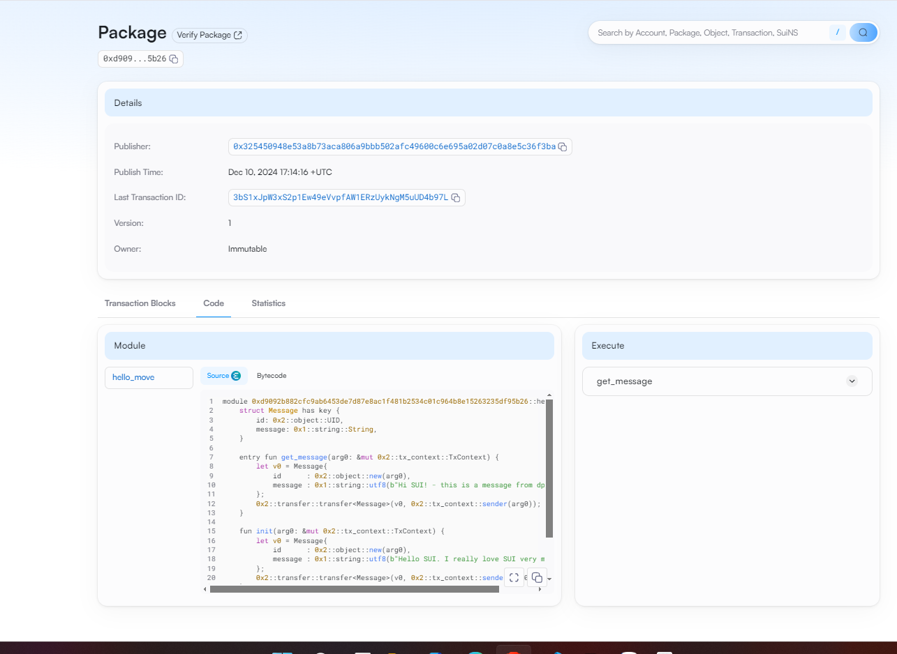

## Basic Information
- Sui Wallet Address: `0x325450948e53a8b73aca806a9bbb502afc49600c6e695a02d07c0a8e5c36f3ba`
> First-time participants must complete the registration of the wallet address through the first task to have it merged. You should use this address for subsequent tasks. We will also use this address to credit the learning rewards.
- Github: `dpptinh`

## Personal Introduction  
- **Work Experience:** Over 1 year of experience in AI, particularly in NLP.  
- **Tech Stack:** Python, PyTorch, Langchain,...  
- **Interest:** Currently exploring Web3 and blockchain, with a keen interest in using Move as an entry point into the blockchain field.  
- **Contact:** Telegram `xxx`
- Contact: telegram `@dpphuctinh`

## Tasks

### 01 hello move
- [x] Sui CLI Version: `1.39`
- [x] Sui Wallet Screenshot: Link to image uploaded to `images` folder 
- [x] Package ID: `0xd9092b882cfc9ab6453de7d87e8ac1f481b2534c01c964b8e15263235df95b26`
- [x] Package ID's Screenshot from Explorer: Link to image uploaded to `images` folder. 

### 02 move coin
- [ ] `My Coin` Package ID:
- [ ] `Faucet Coin` Package ID:
- [ ] Transfer `My Coin` hash:
- [ ] `Faucet Coin` address 1 mint hash:
- [ ] `Faucet Coin` address 2 mint hash:

### 03 move nft
- [ ] NFT Package ID:
- [ ] NFT Object ID:
- [ ] Transfer NFT hash:
- [ ] NFT's Screenshot from Explorer: Link to image uploaded to `images` folder.

### 04 move game
- [ ] Game Package ID:
- [ ] Deposit Coin Hash:
- [ ] Withdraw Coin Hash:
- [ ] Play Game Hash:

### 05 move swap
- [ ] Swap Package ID:
- [ ] Call Swap Coin A -> Coin B hash:
- [ ] Call Swap Coin B -> Coin A hash:

### 06 dapp-kit SDK PTB
- [ ] Save Hash:
