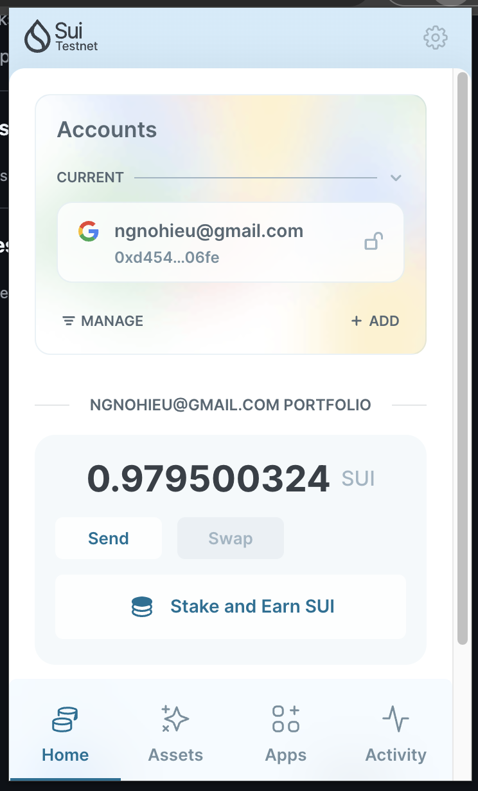
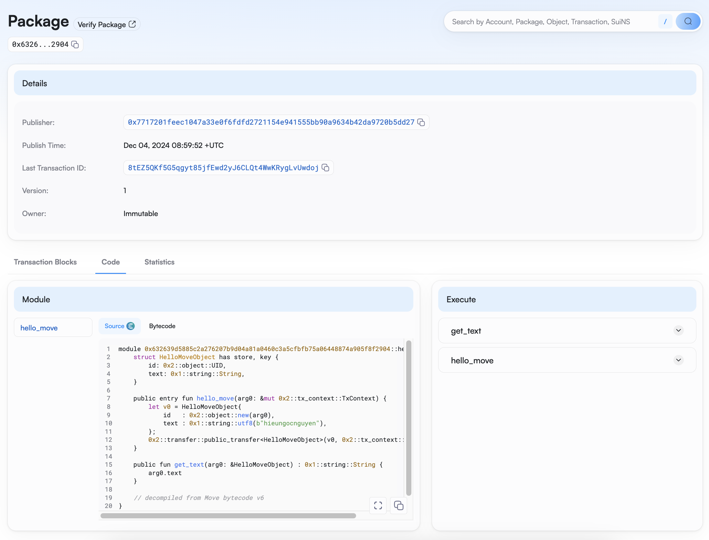
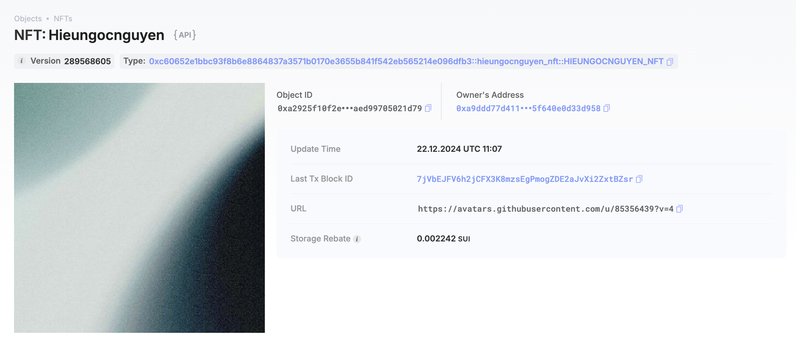

## Basic Information
- Sui Wallet Address: `0xd4544077a889176646eb9c8ad37b865e45a9b97d62e6daebb71bbe78a42106fe`
> First-time participants must complete the registration of the wallet address through the first task to have it merged. You should use this address for subsequent tasks. We will also use this address to credit the learning rewards.
- Github: `hieungocnguyen`

## Personal Introduction
- Work Experience: `1 years`
- Tech Stack: `Javascript` `React` `Nodejs` , etc.
> Important: Please take your personal introduction seriously.
- Experienced in web2 development, passionate about creating useful products. With my interest in blockchain, i will add it to my skillset in my career and Move will be one of them, hope this will be an interesting journey
- Contact: telegram `hieungocnguyen`

## Tasks

### 01 hello move
- [x] Sui CLI Version: sui 1.38.2-homebrew
- [x] Sui Wallet Screenshot: Link to image uploaded to `images` folder.

- [x] Package ID: 0xbae81e9c09d43ddb70efd405cd19c32be8012eb278257399035f3c2d6c9bc6a2
- [x] Package ID's Screenshot from Explorer: Link to image uploaded to `images` folder.

### 02 move coin
- [x] `My Coin` Package ID: 0x1383f54d2831a2f8b902bcb1a4de4e6371eaab889301e732b7000382ed83f03c
- [x] `Faucet Coin` Package ID: 0xcdd6abeaa0703dae6288dd831b1047f2227f2e1a7ceb9a6c3b987f81a0c58d50
- [x] Transfer `My Coin` hash: 8nPjmYiQjeeLai1z9kb4SxcgVvH6NUS7s6iPSZn8LNEY
- [x] `Faucet Coin` address 1 mint hash: 4YVt7e9iZVnopF4q5hHSBQdopfLjZKU7U8cvQsLeuNFo
- [x] `Faucet Coin` address 2 mint hash: 7fit7NhsXCTDDyU3xqJZB2CG35mGd3HaLf3cvGg6iui5

### 03 move nft
- [x] NFT Package ID: 0xc60652e1bbc93f8b6e8864837a3571b0170e3655b841f542eb565214e096dfb3
- [x] NFT Object ID: 0xa2925f10f2e35deffcc3a04b79d71466f1b14a7b928b167124aed99705021d79
- [x] Transfer NFT hash: 7jVbEJFV6h2jCFX3K8mzsEgPmogZDE2aJvXi2ZxtBZsr
- [x] NFT's Screenshot from Explorer: Link to image uploaded to `images` folder.

### 04 move game
- [ ] Game Package ID:
- [ ] Deposit Coin Hash:
- [ ] Withdraw Coin Hash:
- [ ] Play Game Hash:

### 05 move swap
- [ ] Swap Package ID:
- [ ] Call Swap Coin A -> Coin B hash:
- [ ] Call Swap Coin B -> Coin A hash:

### 06 dapp-kit SDK PTB
- [ ] Save Hash:
