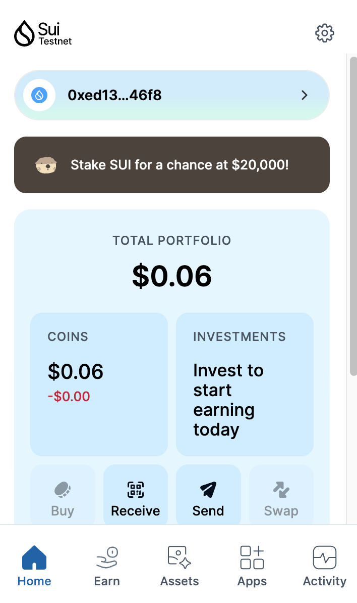
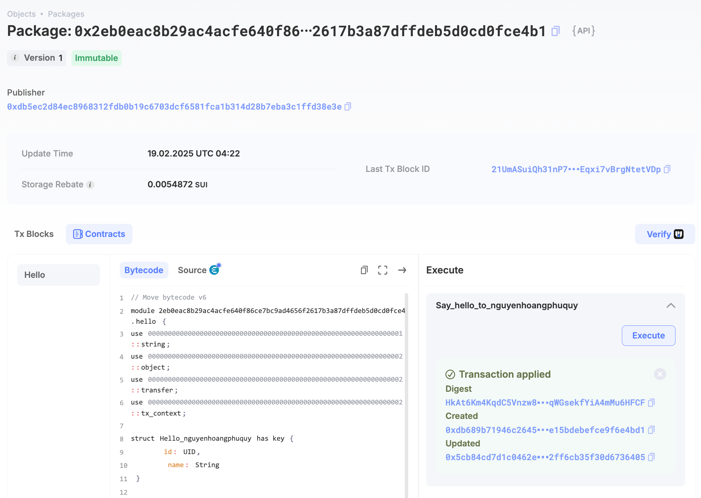
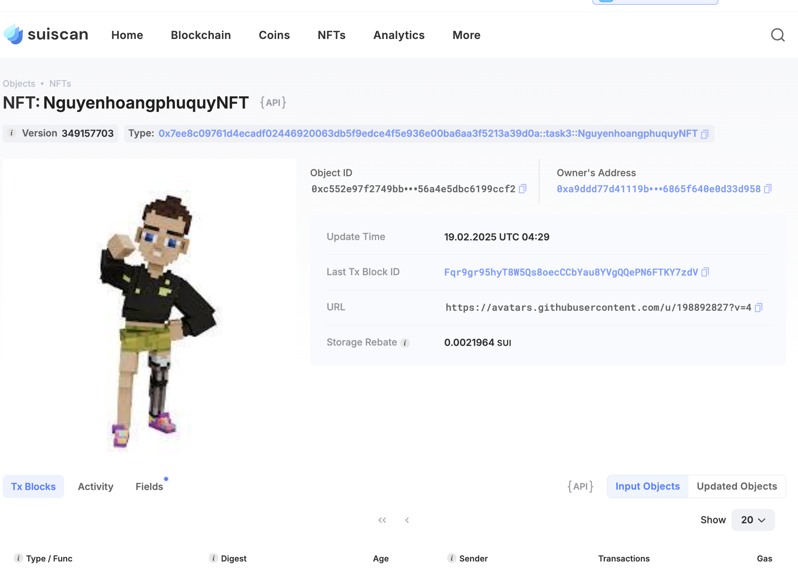

## Basic Information
- Sui Wallet Address: `0xed135194a6692ddf194ce39d06d8af11382ef01e3353a2f1a355aef82c1246f8`
> First-time participants must complete the registration of the wallet address through the first task to have it merged. You should use this address for subsequent tasks. We will also use this address to credit the learning rewards.
- Github: `nguyenhoangphuquy`

## Personal Introduction
- Work Experience:  `student`
- Tech Stack: `JavaScript`, `Move`, `Solidity`
> I am a final-year student majoring in software engineering. For most of my studies, I focused on Web2 development—building RESTful APIs, working with databases, and optimizing server-side performance. But I always felt like something was missing. Web3 opened up a new way of thinking about data, ownership, and security, and when I discovered Sui, it all started to make sense.Move is different from any programming language I have worked with before, but it forces me to think carefully about how resources are managed. Right now, I am building my first DeFi project on Sui, which aims to create a lending platform with enhanced security guarantees. My ambition is to launch a startup in the Web3 space and contribute to the development of financial tools that are accessible to everyone.
- Discord: `Edward Dev`

## Tasks

### 01 hello move
- [x] Sui CLI Version: sui 1.42.0
- [x] Sui Wallet Screenshot: 
- [x] Package ID:0x2eb0eac8b29ac4acfe640f86ce7bc9ad4656f2617b3a87dffdeb5d0cd0fce4b1
- [x] Package ID's Screenshot from Explorer: 

### 02 move coin
- [x] `My Coin` Package ID:0xeaa490ff93199bf56ddfdb230751225662c7abf1cc36c698d4fffedfd94ea266
- [x] `Faucet Coin` Package ID:0x717301f818bc0b613ab4937ce30afb3eecd3aebfb791df3fec1c80edddffdd68
- [x] Transfer `My Coin` hash:B5xm12peBr83pA8kriJMUnVTN7GcWxqvJQWYbZyz8Evs
- [x] `Faucet Coin` address 1 mint hash:BdJDDyade7CyV2RMUN4rAxe9SawdTcQZiTbaPTJKbEwW
- [x] `Faucet Coin` address 2 mint hash:CZKCmVbAfjpqcruHWDADDLPNhss5iZceNVm5Q5XgDzPB

### 03 move nft
- [x] NFT Package ID:0x7ee8c09761d4ecadf02446920063db5f9edce4f5e936e00ba6aa3f5213a39d0a
- [x] NFT Object ID:0xc552e97f2749bbb7b35d82232bf81fdec2dbabaf5964a4f56a4e5dbc6199ccf2
- [x] Transfer NFT hash:Fqr9gr95hyT8W5Qs8oecCCbYau8YVgQQePN6FTKY7zdV
- [x] NFT's Screenshot from Explorer: 

### 04 move game
- [x] Game Package ID:0x45b93f73b0f1ecc589cee17c3c6dbe4b5d62fab96ff815505edcd06b83070757
- [x] Deposit Coin Hash:Df1brat8VwQKLEbdTkTDra6MAkkGQen19aaVriEa3Tdr
- [x] Withdraw Coin Hash:CsgYJcS7TBqdG14rAjeAeS8v67rFbtS7WUBe9eDkmSE7
- [x] Play Game Hash:2qryo7y1gQz4KYJCcU6vVCim4cq4h1WffXU4pRdv7ijC

### 05 move swap
- [x] Swap Package ID:0x3a9db2b8f454b1ddb72c6b7ccf00f3e9e10f84d9fa2bf7a256951f7fcb42851a
- [x] Call Swap Coin A -> Coin B hash:FejGNQBP5XhK8xZy9CWb7ARicjqPkGtaqgBSYRNMuNqE
- [x] Call Swap Coin B -> Coin A hash:47GcDKA5jYsmpdQYuXKXgyqawsQMxnncJxpHT5TTw2hR

### 06 dapp-kit SDK PTB
- [x] Save Hash:BGFQiZbpSZXvXN6grRGWapRMDUqkchThexmwecW9hLey
