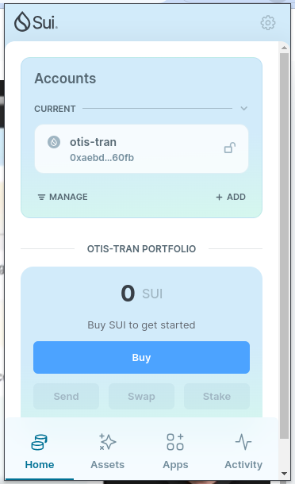
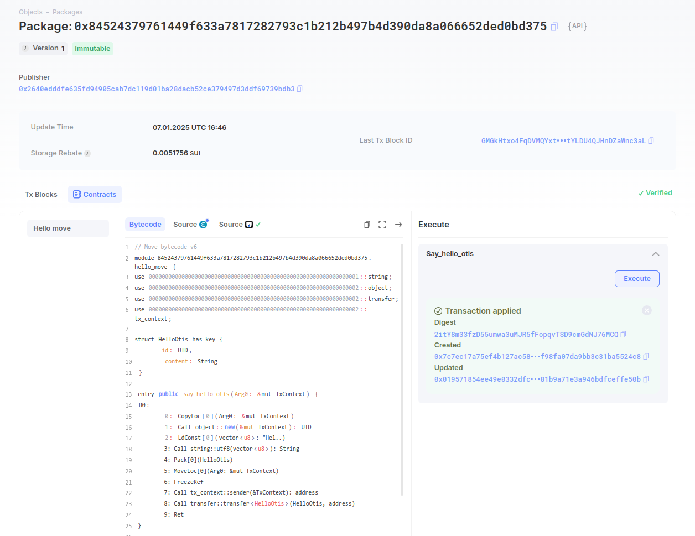

## Basic Information
- Sui Wallet Address: `0xaebd8a3bc80ea711937bf1831cd5a97b6c166d591594cf87d6338ecd3f1a60fb`
> First-time participants must complete the registration of the wallet address through the first task to have it merged. You should use this address for subsequent tasks. We will also use this address to credit the learning rewards.
- Github: `otis-tran`

## Personal Introduction
- Work Experience: `3 years`
- Tech Stack: `Kotlin` `Java` `JavaScript` `Android`
> Important: Please take your personal introduction seriously.
- I have nearly 3 years of experience in web2 development, focusing primarily on Android using Kotlin and Java. Over the past year, I have been involved in Android Automotive projects, contributing to the development of applications within large embedded systems for cars. I am particularly interested in blockchain development, aiming to explore Move and Solidity as entry points into the world of web3. My goal is to transition into DeFi and dApp development, leveraging my mobile expertise to build innovative blockchain applications. I am continuously learning about Ethereum, Sui and Chainlink to expand my understanding of smart contracts and blockchain protocols.
- Contact: telegram `otis_tran`

## Tasks

### 01 hello move
- [x] Sui CLI Version: sui 1.39.3
- [x] Sui Wallet Screenshot:   
- [x] Package ID: 0x84524379761449f633a7817282793c1b212b497b4d390da8a066652ded0bd375
- [x] Package ID's Screenshot from Explorer:   

### 02 move coin
- [ ] `My Coin` Package ID:
- [ ] `Faucet Coin` Package ID:
- [ ] Transfer `My Coin` hash:
- [ ] `Faucet Coin` address 1 mint hash:
- [ ] `Faucet Coin` address 2 mint hash:

### 03 move nft
- [ ] NFT Package ID:
- [ ] NFT Object ID:
- [ ] Transfer NFT hash:
- [ ] NFT's Screenshot from Explorer: Link to image uploaded to `images` folder.

### 04 move game
- [ ] Game Package ID:
- [ ] Deposit Coin Hash:
- [ ] Withdraw Coin Hash:
- [ ] Play Game Hash:

### 05 move swap
- [ ] Swap Package ID:
- [ ] Call Swap Coin A -> Coin B hash:
- [ ] Call Swap Coin B -> Coin A hash:

### 06 dapp-kit SDK PTB
- [ ] Save Hash:
