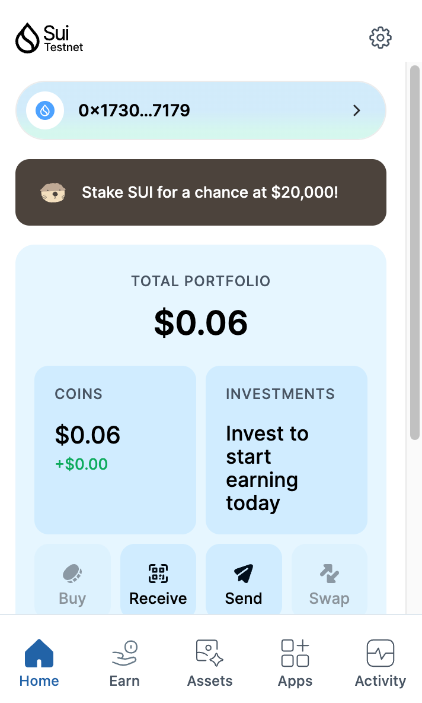
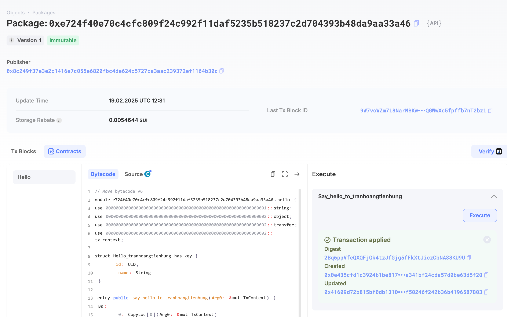
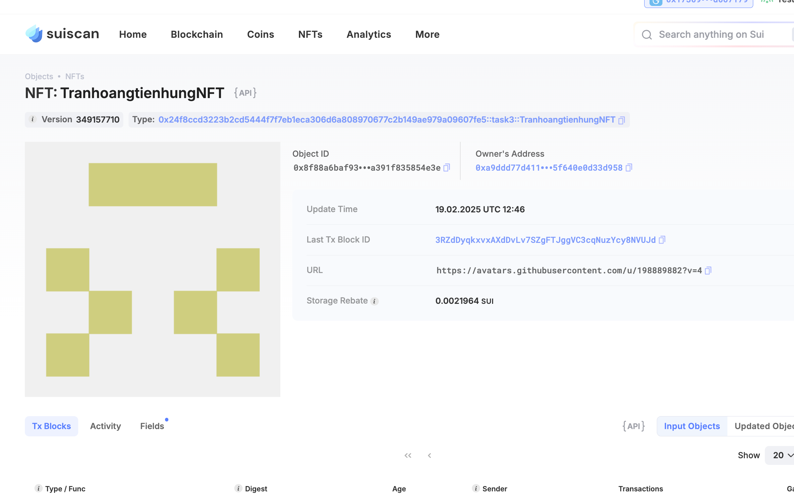

## Basic Information
- Sui Wallet Address: `0x1730957ed24e0b5ac4261e5a60476207067b963115edcb57d3ab4fbcdd067179`
> First-time participants must complete the registration of the wallet address through the first task to have it merged. You should use this address for subsequent tasks. We will also use this address to credit the learning rewards.
- Github: `tranhoangtienhung`

## Personal Introduction
- Work Experience: `0 years`
- Tech Stack: `Java`, `Move`, `Python`
> Important: I am a third-year computer science student at Swinburne University of Technology, with a strong interest in backend development and system architecture. My journey into blockchain started as a curiosity—something I read about but never explored deeply. That changed when I joined a Sui hackathon. Move’s unique approach to ownership and Sui’s ability to handle high transaction volumes without congestion showed me how blockchain could solve real-world problems in a way Web2 systems never could.
Since then, I have been dedicating my time to learning Move, writing small smart contracts, and participating in coding challenges. The learning curve has been steep, but I enjoy the challenge. My goal is to secure an internship in the Sui ecosystem and work on real projects that contribute to the network’s growth. In the long run, I want to become a core developer specializing in blockchain infrastructure.
- Discord: `Michelle Blake`

## Tasks

### 01 hello move
- [x] Sui CLI Version: sui 1.42.0
- [x] Sui Wallet Screenshot: 
- [x] Package ID:0xe724f40e70c4cfc809f24c992f11daf5235b518237c2d704393b48da9aa33a46
- [x] Package ID's Screenshot from Explorer: 

### 02 move coin
- [x] `My Coin` Package ID:0xc80cbb68f245bd0b5b32234224c1db409c21c7f3ea5c8729f4c19ef8945935b9
- [x] `Faucet Coin` Package ID:0xa50b43cccc9f9ad1bef2c40788dbd88f97ad3f7dfa0a5ebed5b3306cbe0e6d51
- [x] Transfer `My Coin` hash:2bCid8c43VqbjxWN2EkRfg6g1JuMFN2yxDXqra9m5Mxw
- [x] `Faucet Coin` address 1 mint hash:44i5ksDS6u9pgzjXvK7hZvfdYp3GnguxwqaSgnxwodi3
- [x] `Faucet Coin` address 2 mint hash:FTVEAxULWurcH9kV95pQ1JKQoZX3yUfxp5pJQp1fP1jW

### 03 move nft
- [x] NFT Package ID:0x24f8ccd3223b2cd5444f7f7eb1eca306d6a808970677c2b149ae979a09607fe5
- [x] NFT Object ID:0x8f88a6baf9355c82c407a05b334ae6e58d09ba95fa66d2b828a391f835854e3e
- [x] Transfer NFT hash:3RZdDyqkxvxAXdDvLv7SZgFTJggVC3cqNuzYcy8NVUJd
- [x] NFT's Screenshot from Explorer: 

### 04 move game
- [x] Game Package ID:0x6d1116e1abc6d7101bef3292e4b9aa50c1680cf6e3207031dc4b281b3913554c
- [x] Deposit Coin Hash:GwqoW7Yr4H2g5qS1mZRKZogiCiuYxH5iz3zueewFrmER
- [x] Withdraw Coin Hash:8nAfns3BWEeQxTD6LuUTpeLJpJpmQM2VEvKfegSGQ7n3
- [x] Play Game Hash:CAZJ1uYjUGb2ntYX9N21jYeUxQu3xiRn5CKkKWnSxD29

### 05 move swap
- [x] Swap Package ID: 0xf83df1c2b67403b9d8188255d57f9cb7a093d42e5bc0971b08c702da792131db
- [x] Call Swap Coin A -> Coin B hash:G7QXEcx5tmPLCWKsutXaqdSs1GesAtqRBhYBcCPgqMbc
- [x] Call Swap Coin B -> Coin A hash:2ovBCuKC14t5kYM9ZZCi2HagEHY2LbPNF3y1GvsCF21X

### 06 dapp-kit SDK PTB
- [x] Save Hash:6HR15yFRmsFcdVmE62DmWZ3KqHBqKA2NstoMwGSajRm6
